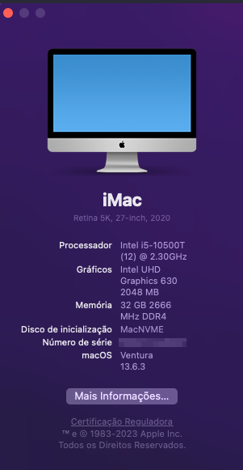

## ThinkCentre-M70q Hackintosh OpenCore EFI


### Supported model

- M70q


### OpenCore

[OpenCore 1.0.0](https://github.com/acidanthera/OpenCorePkg)


### macOS

- Ventura - V


### Spec
- Model: iMac20,1
- CPU: Intel 10th i5-10500T 2.5Gz (Coffee Lake)
- Memo: 32GB(2x16GB) DDR4 2666 Mhz
- iGPU: Intel UHD Graphic 630
- Audio Codec : Realtek ALC235
- SSD: RZX DRAGO 512G
- Ethernet : Intel I219V11 Gigabit Ethernet
- Wifi/ Bluetooth: Intel Ax210 wi-fi 6 - Off
- HDMI AND DP Work


### BIOS

```
Devices
  |-- ATA Drive Setup
    |-- Configure STAT as: ACHI
  |-- Video Setup
    |-- Select Active Video: IGD
    |-- Pre-Allocated Memory Size: 64MB
    |-- Total Graphics Memory: Maximum

Advanced
  |-- CPU Setup
    |-- Intel(R) Hyper-Threading Technology: Enabled
    |-- Core Multi-Processing: Enabled
    |-- Intel(R) Virtualization Technology: Enabled

Power
  |-- Automatic Power On
    |-- Wake on LAN: Disabled
    
Security
  |-- Secure Boot
    |-- Secure Boot: Enable

Startup
  |-- Fast Boot: Disabled
```

### Notes


### Screenshot

